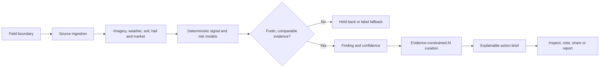

# NocPulse


**Evidence-led agricultural decision intelligence for growers and agronomists.**

NocPulse combines field boundaries, satellite imagery, weather, soil, crop
context, hail and market data into one workspace. Its central design challenge
is not showing more layers; it is helping someone understand what changed, how
trustworthy the signal is and what to inspect next.

The codebase was developed internally as **FieldPulse v3**. NocPulse is the
product name used in the interface.

> **Status:** Controlled-beta product build and portfolio case study. No public
> production URL is advertised from this repository. The complete repository
> check passed in public CI on 2 September 2026 at `16f3710`; the dated result
> and its limits are linked under [Verification](#verification). A passing
> source check is not evidence of a healthy deployment or customer adoption.

## The product problem

Agricultural monitoring products can overwhelm people with maps, indices and
weather charts while leaving the operational question unanswered: **what needs
attention now?**

NocPulse is organized around a field-level decision loop:

1. Add a field from a legal land description, geofile, spreadsheet or manual
   boundary.
2. Hydrate it with source-backed imagery, weather, soil and crop context.
3. Compare current conditions with recent valid observations.
4. Surface material changes with severity, freshness and provenance.
5. Recommend the first field inspection or operational check.
6. Record notes, share a bounded view or export an evidence-rich report.



## What makes the AI trustworthy

The generative model is not asked to invent agronomy or decide whether a signal
exists. Deterministic application logic establishes the facts first.

- **Evidence gates precede generation.** Action briefs require recent,
  comparable, source-backed snapshots with acceptable confidence.
- **Weak inputs are explicit.** Synthetic rasters, seeded blends and stale or
  low-freshness observations are rejected or labeled rather than silently
  promoted.
- **Material-change thresholds are coded.** Moisture movement must cross a
  defined threshold before it becomes an active finding.
- **The prompt is fact-bounded.** Gemini receives an existing fact object and
  is instructed to rewrite only the interface copy—never invent a metric,
  severity, zone, crop stage or finding.
- **Confidence is inspectable.** Freshness, data-source quality and comparison
  depth are part of the product state.
- **Actions remain reversible.** The system recommends what to inspect first;
  it does not autonomously change irrigation, spray or crop-management systems.

This separation between evidence, policy and language generation is the core
AI-design pattern in the project.

## Implemented intelligence

| Capability | Examples |
|---|---|
| Field intake | Manual boundaries, geofiles, spreadsheets and legal land descriptions |
| Remote sensing | Provider discovery, raster materialization, NDMI/NDRE and moisture surfaces |
| Weather | Forecasts, anomalies, frost probability, VPD and spray windows |
| Soil | SoilGrids-backed properties and depth-aware translation |
| Crop risk | Moisture stress, hail and crop-specific disease findings |
| Market context | Grain prices, yield and basis assumptions |
| Field work | Zones, scouting notes, alerts and action briefs |
| Reporting | Share tokens, PDF reports and crop-detail exports |

## Interaction model

The workspace keeps a map as context and a focused field panel as the decision
surface. Users can move between Summary, Report, Zones, Crops, Market, Notes
and Actions without losing the selected field.

The visual system is intentionally editorial rather than dashboard-like:

- P22 Mackinac for a small number of hero values.
- Sintony for interface language.
- IBM Plex Mono for coordinates, timestamps and measured data.
- Calm paper surfaces and generous spacing.
- Green, amber and red reserved for agricultural health semantics.
- One focal action per section, with explicit empty and loading states.

See [the design-system specification](./apps/web/DESIGN-SYSTEM.md) and
[UI source-of-truth notes](./docs/ui-source-of-truth.md).

## Architecture

NocPulse is a modular monolith with a deliberate runtime split:

```text
apps/web/                 Next.js product and API composition
apps/worker/              Long-running ingestion and intelligence jobs
packages/modules/         Fields, imagery, moisture, weather, crops, reports...
packages/platform/        Config, database, jobs, observability, runtime, storage
packages/map/             MapLibre/deck.gl rendering boundary
packages/raster/          GeoTIFF and raster transforms
packages/pdf/             Report rendering and font embedding
```

Business packages follow `contracts → domain → application → infrastructure`.
The web app does not access the database directly, map-engine APIs stay behind
the map package, and long-running work is dispatched to a persistent worker.
An automated boundary checker enforces those rules.

### Platform foundations

- Workspace-scoped PostgreSQL/PostGIS model with row-level access boundaries.
- Supabase repositories and authentication.
- Persistent job queue with attempts, phases, cancellation, replay and stale
  recovery.
- Prometheus-style queue metrics plus structured observability.
- R2-compatible object storage for artifacts.
- MapLibre/deck.gl rendering contracts for terrain, cells and picking.
- Provider probes and fallback reporting for imagery availability.

## Run locally

NocPulse uses pnpm workspaces:

```bash
corepack enable
corepack prepare pnpm@10.0.0 --activate
pnpm install
pnpm dev:web
```

Run the worker separately when exercising ingestion or intelligence jobs:

```bash
pnpm dev:worker
```

Copy `.env.example` to an ignored local environment file and supply only the
development credentials needed for the path being tested. Never commit API
keys, signing keys or database credentials.

## Verification

Latest verified public CI checkpoint: **2 September 2026**, commit
[`16f3710`](https://github.com/ojieame12/nocpulse-final/commit/16f37104718622b2285989607729d35addf550b2).
The [successful run](https://github.com/ojieame12/nocpulse-final/actions/runs/33612823266)
executed the repository's complete check command with Node.js 24 and pnpm 10:

```bash
pnpm install --frozen-lockfile
pnpm check
```

`check` runs the architecture boundary gate, TypeScript checks, the configured
test suite, and the web and worker builds. The boundary/test-fixture failures
recorded on 1 September were addressed by the later revision; they are not
the current result. This checkpoint was verified from the published workflow,
not rerun against production infrastructure. Provider health, live data quality,
deployment readiness and product outcomes need separate evidence.

The repository contains focused tests for field intake, imagery, crop risks,
weather, report models, map rendering, workspace settings, panel rendering,
worker cadences and PDF generation.

## Further reading

- [Modular-monolith rules](./docs/architecture/modular-monolith.md)
- [Rendering contract](./docs/architecture/rendering-contract.md)
- [Data foundation](./docs/architecture/data-foundation.md)
- [Controlled-beta runbook](./docs/controlled-beta-runbook.md)
- [Launch go/no-go framework](./docs/launch-go-no-go.md)

## License

Portfolio source. No license is granted for reuse or redistribution.
